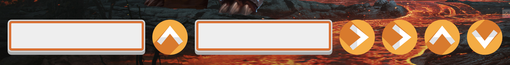

# GA Software Engineering Immersive: Project 1

---

# Rhythm of Doom

(A Game created using Javascript)

</img>

## Built With

1. HTML5
2. CSS
3. Javascript
4. jQuery

## Deployment

The game is deployed on GitHub Pages and it can be found here: https://pages.git.generalassemb.ly/ali-haji4/Project_1/.

## Features:

- Random sequence shows on the screen for the user to input in the corect order
- Sequence shuffles once completed
- Countdown shows before the game starts
- Each completed sequences damages the enemies health
- Both Enemies have unique health
- Enemy changes upon defeat
- Keeping of the Score, Sequences Completed, Timer, Game Status, and Highest Streak
- Stores the gameplay information until the page is refreshed
- Defeat upon running out of time, or making numerous mistakes
- Screen flashes red upon taking damage by making a mistake

## Gameplay Interface

## How To Play:

</img>

1. At The bottom of the screen, a random sequence that consists of arrow keys and the space key shows up
2. The play must input the sequence correctly using the keys, and going from left to right
3. Once the sequence is completed, the sequence is shuffled and a new one shows up
4. The game continues giving the player random sequences until either the lost or the win conditions are met

## Lose Conditions:

- Running out of Time
- Making Numerous mistakes during the sequences

## Win Condition:

- Defeat the enemies before time runs out

---

## Future improvements

- Leaderboard - the current game saves the players score and information but does not maintain a leaderboard.
- Music and Sound Effects - the game currently lacks sound effects and a general music theme that suits the game.
- Make it mobile friendly.

---

## Author

Ali Haji
